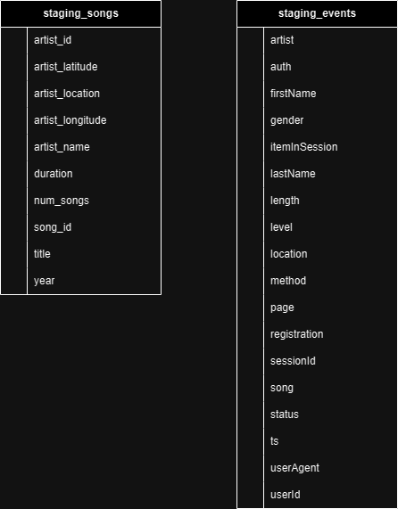

# Data Warehouse with Redshift

In this project, we will build an  ETL pipeline for a database hosted on Redshift. We'll load data from S3 to staging tables on Redshift and execute SQL to transform data to another table in Star Schema

Their analytics team to continue finding insights into what songs their users are listening to.
### Source data

Dataset stored in S3, the udacity-dend bucket is situated in the **us-west-2** region:
* Song data: s3://udacity-dend/song_data
* Log data: s3://udacity-dend/log_data

To properly read log data s3://udacity-dend/log_data, you'll need the following metadata file:
* Log metadata: s3://udacity-dend/log_json_path.json

### Data model

#### Staging tables

#### Star schema tables

From song and event dataset, we'll create a star schema optimized for queries on song play analysis. This following tables:

1. users table: user in the app
   * PK: user_id ~ unique id for all user
2. artists table:
   * PK: artist_id ~ unique id for all artist
3. songs table:
   * PK: song_id ~ unique id for all song
   * FK: artist_id ~ artist_id of song
4. songplays table:
   * PK: songplay_id ~ unique id for all song play(auto increase) with page **NextSong**
   * FK: artist_id ~ artist_id of song play
   * FK: song_id ~ song_id of song play
   * FK: user_id ~ user_id of user play song
5. time table:
   * PK: start time ~ unique timestamp of records in songplays table
   

### Project file

1. **create_table.py** is where we'll create our staging/fact and dimension tables for the star schema in Redshift. 
2. **etl.py** is where we'll load data from S3 into staging tables on Redshift and then process that data into your analytics tables on Redshift. 
3. **sql_queries.py** is where we'll define SQL statements, which will be imported into the two other files above. 
4. **dwh.cfg** is where we'll define config of connection to Redshift, S3 part of dataset, IAM role

### ETL pipeline

1. run **create_table.py**
   * drop_tables: drop all table if exist
   * create_tables: create all table if not exist
2. run **etl.py**
   * load_staging_tables: load data from S3 to staging tables in database
   * insert_tables: move data from staging tables to star schema's tables
   * get_most_played_song: execute query get_most_played_song 